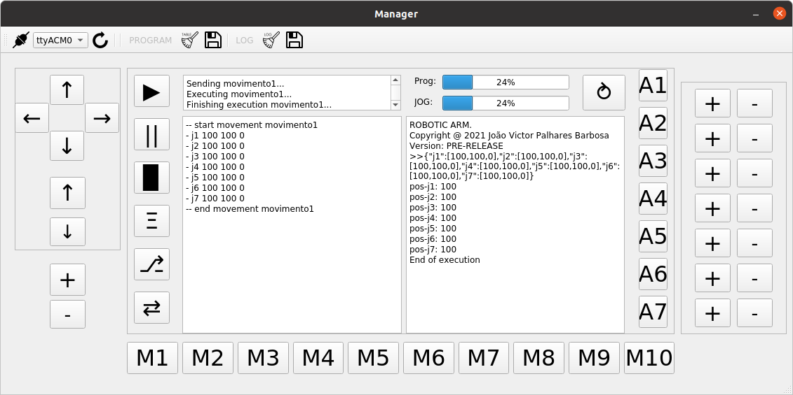

<h1 align="center">Robotic ARM</h1>

<h3 align="center">
This is a little project to manipulate a robotic arm.
</h3>

# 📦 Project
This repository has the manager and firmware to use on your robotic arm.

# 🗃 Manager

# 👨‍💻 Creator

- <b>[João Victor Palhares Barbosa](https://www.linkedin.com/in/vicpb/)</b>

# 🛒 Release

To check the robotic arm version, [click here](https://github.com/jvpalhares/robotic-arm/releases).
